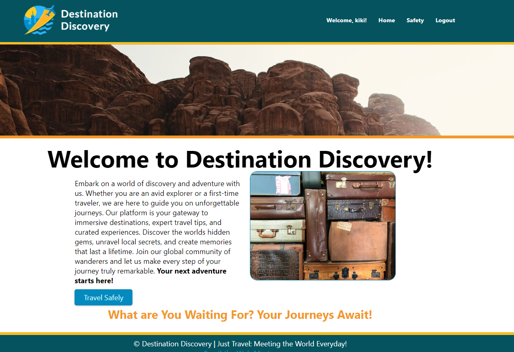

# MMC 6145: Final Project
Submitted by Kristine Christensen

![!\[picture alt\] (public/images/logob.png)](public/images/logob.png)

## Destination Discovery
Travel Planning Made Easy will be a user-friendly travel destination finder that will help reduce stress and eliminate the guesswork from travel planning for future travelers. 

## Features
This was to be a web app that allowed individuals to search reviews and select their favorits which would be stored in a database. I had access to the Tripadvisor API but it turned out to be too restrictive so I had to pivot. I found the New York Times articles on Travel which are searchable. Users can search for a city and relevant news about that city will be displayed. 

## Run It Local
Currently, I am having difficulty with getting the database to connect so if you would like to run it locally, please download my files and use an editor like VSCode to run it. You'll need to ensure you have Node.js installed and will need to run npm i to install the dependencies. 

Check back soon, the issue should be resolved.
